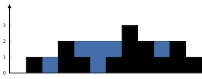
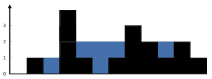
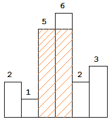
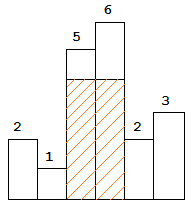
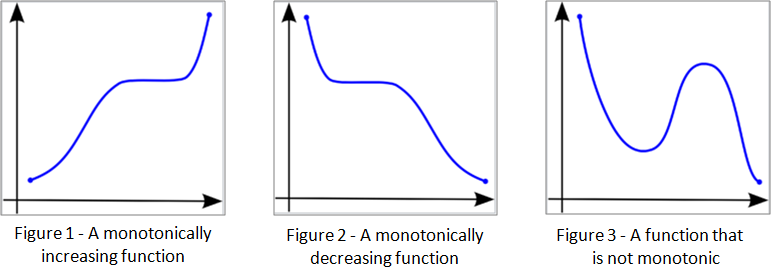

Bar graph algorithm questions are tricky; visually we can see the entire 2D view and make quick optimal decisions. But algorithmically it seems like there is a lot of traversing...?
Let's solve two such problems. 

## [Trapping Rain Water](https://leetcode.com/problems/trapping-rain-water/)
**Given a bar graph, how much water can it trap?**



Here we can trap 6 "units" of water.

**Claim**: For any *i*, the amount of water held at *i* is "bounded" by the minimum of the maximum heights on the left and on the right.

**Proof**: This image of a counter example should make it clear:




**Algorithm**: At each *i*, find the maximum to the left, find the maximum to the right, get the minimum of those 2. Then, subtract out the height of *i* (this is "ground level" at position *i*). This is the water that can be trapped at *i*. To find the total, we simply sum all the water trapped at each *i*.

## [Largest Rectangle](https://leetcode.com/problems/largest-rectangle-in-histogram/) 

**Given a bar graph, what is the largest rectangle that can be made?**



Here, the largest triangle is shown above with an area of 10 (2x5).

**Claim**: Our answer will include at least one "entire bar".

**Proof**: Counter example, say we have an answer that doesn't include any entire bar. 

The height bound of the rectangle is the maximum height of the bars it includes.
We don't have any entire bars which means we are at least 1 unit less than the maximum.
The rectangle that contains this entire bar is also valid and has a larger area.
Thus, the original answer is incorrect.



**Algorithm**: At each *i*, we get the answer using this entire bar at *i*. We need the first element less than *i* to the left and the first element less than *i* to the right. That gives us the span (width) of this answer. The height of this answer is simply *i*. We multiply to find the answer.


## Monotonic Queue

A monotonic queue is a data structure that preserves a monotonic sequence. 

In early calculus, you learn about monotonically increasing or decreasing functions:



This is essentially what we are trying to preserve. In most cases we also want strictly increasing or decreasing.

A general structure can be:

```java
public interface MonotonicQueue<Item>
{
    void push(Item item);

    Item pop();

    Item peek();
}

```

## Back to Trapping Rain Water

We can implement this algorithm with two monotonic queues. One to find maximum to the left, one to find maximum to the right.
For simplicity, we're going to work with int's here as we only care about the indices (we can get the heights from the array in O(1) so no need to store).
```java
public class MaxToLeft{
    
    private final int[] processedItems;

    public MaxToLeft(int[] items) {
        this.processedItems = new int[items.length];

        int maxSoFar = Integer.MIN_VALUE;
        for(int i = 0; i < items.length; i++){
            maxSoFar = Integer.max(items[i], maxSoFar);
            processedItems[i] = maxSoFar;
        }
    }

    int get(int i){
        return processedItems[i];
    }
}
```

And similarily:
\
<sub><sup>Note: in this case we could have simply re-used `MaxToLeft` and reversed our input. But for clarify, it is explicitly given.</sup></sub>
```java
class MaxToRight{

    private final int[] processedItems;

    public MaxToRight(int[] items) {
        this.processedItems = new int[items.length];

        int maxSoFar = Integer.MIN_VALUE;
        for(int i = items.length-1; i >= 0 ; i--){
            maxSoFar = Integer.max(items[i], maxSoFar);
            processedItems[i] = maxSoFar;
        }
    }

    int get(int i){
        return processedItems[i];
    }
}
```

And finally, the algorithm:

```java
    public int trap(int[] height) {
        MaxToLeft maxToLeft = new MaxToLeft(height);
        MaxToRight maxToRight = new MaxToRight(height);

        int totalWaterTrapped = 0;
        for(int i = 0; i < height.length; i++){
            int waterTrappedHere = Integer.min(maxToLeft.get(i), maxToRight.get(i)) - height[i];
            totalWaterTrapped += waterTrappedHere;
        }

        return totalWaterTrapped;
    }
```

<details>
    <summary>Full leetcode compatible solution</summary>
    
Code that you can paste into LeetCode:

```java
    class Solution {
        public int trap(int[] height) {
            MaxToLeft maxToLeft = new MaxToLeft(height);
            MaxToRight maxToRight = new MaxToRight(height);
    
            int totalWaterTrapped = 0;
            for(int i = 0; i < height.length; i++){
                int waterTrappedHere = Integer.min(maxToLeft.get(i), maxToRight.get(i)) - height[i];
                totalWaterTrapped += waterTrappedHere;
            }
    
            return totalWaterTrapped;
        }
    }

    class MaxToLeft{

        private final int[] processedItems;
    
        public MaxToLeft(int[] items) {
            this.processedItems = new int[items.length];
    
            int maxSoFar = Integer.MIN_VALUE;
            for(int i = 0; i < items.length; i++){
                maxSoFar = Integer.max(items[i], maxSoFar);
                processedItems[i] = maxSoFar;
            }
        }
    
        int get(int i){
            return processedItems[i];
        }

    }

    class MaxToRight{
    
        private final int[] processedItems;
    
        public MaxToRight(int[] items) {
            this.processedItems = new int[items.length];
    
            int maxSoFar = Integer.MIN_VALUE;
            for(int i = items.length-1; i >= 0 ; i--){
                maxSoFar = Integer.max(items[i], maxSoFar);
                processedItems[i] = maxSoFar;
            }
        }
    
        int get(int i){
            return processedItems[i];
        }
    
    }

```

</details>

# Largest Rectangle

The largest rectangle is left as an exercise :) 